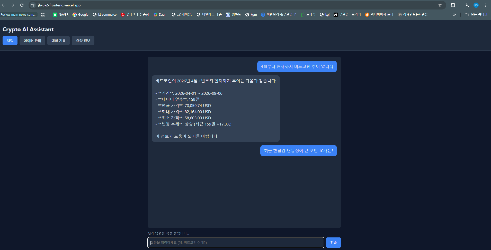
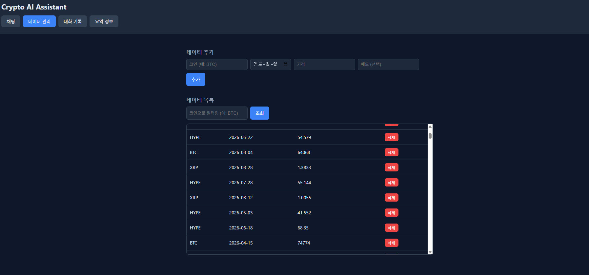
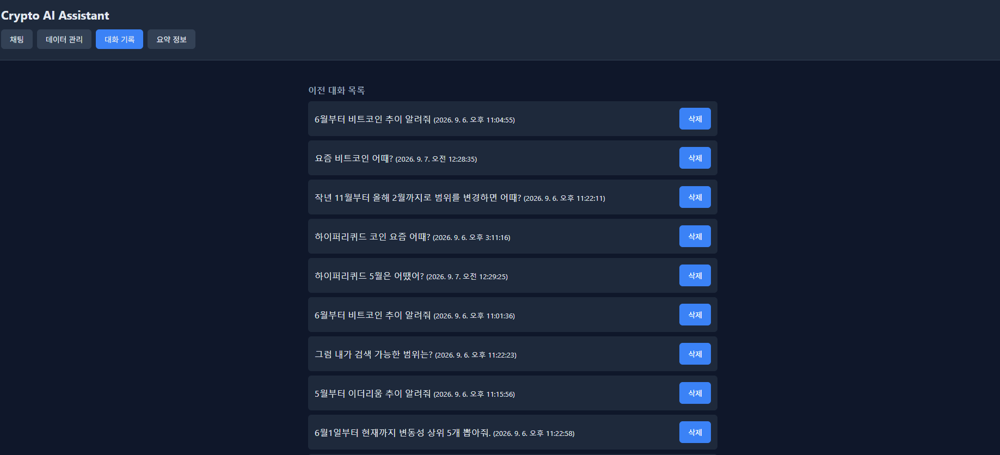
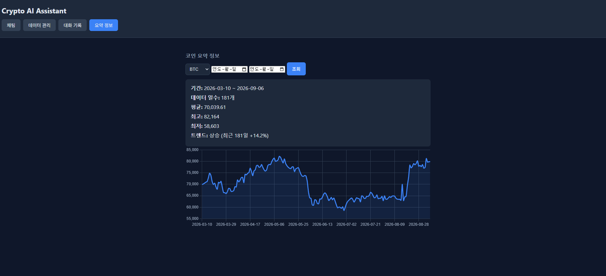

# Crypto AI Assistant

하이퍼리퀴드(Hyperliquid) 거래소의 암호화폐 시계열 데이터를 분석하고,
그 데이터를 기반으로 대화하는 AI 챗봇 서비스입니다.
"내 상황을 아는 AI 비서"를 목표로, 데이터 분석 → 저장 → AI 대화까지 이어지는 흐름을 구현했습니다.

## 배포 URL

| 항목 | 링크 |
|---|---|
| 프론트엔드 (실제 서비스) | https://jh-3-2-frontend.vercel.app |
| 백엔드 API | https://jh-cs-3-2.onrender.com |
| Swagger API 문서 | https://jh-cs-3-2.onrender.com/docs |

## 배포 관련 참고 사항

### 콜드 스타트(Cold Start) 안내

백엔드는 Render 무료 티어에 배포되어 있어, 일정 시간(약 15분) 요청이 없으면 서버가 절전 상태로 전환됩니다.
절전 상태에서 첫 요청을 보내면 서버가 다시 깨어나는 데 **약 30초~1분 정도** 지연이 발생할 수 있습니다.
이는 오류가 아니라 무료 티어의 정상적인 동작이며, 프론트엔드의 채팅 화면에서는 로딩 표시("AI가 답변을 작성 중입니다...")를 통해 응답을 기다리는 동안 사용자에게 진행 상황을 안내합니다.

### 프론트엔드 API 주소 설정 방식

프론트엔드는 Vercel의 서버사이드 환경변수 대신, `script.js` 상단의 `API_BASE_URL` 상수에 백엔드 배포 주소를 직접 지정하는 방식을 사용했습니다.
바닐라 HTML/CSS/JS는 별도의 빌드 과정이 없는 정적 파일 배포 구조라, Vercel의 환경변수(빌드 타임에만 주입 가능)를 런타임에 그대로 활용하기 어려운 제약이 있습니다.
로컬 개발 시에는 `http://127.0.0.1:8000`으로, 배포 시에는 Render 배포 주소(`https://jh-cs-3-2.onrender.com`)로 이 상수 값만 변경하여 사용합니다.

## 저장소

| 구분 | 저장소 |
|---|---|
| 백엔드 (FastAPI) | https://github.com/EC-newsbot/JH-CS-3-2 |
| 프론트엔드 (HTML/CSS/JS) | https://github.com/EC-newsbot/JH-3-2-frontend |

## 기술 스택

- **백엔드**: FastAPI, Python 3
- **프론트엔드**: HTML, CSS, JavaScript (바닐라, 프레임워크 미사용), Chart.js
- **데이터베이스**: Firebase Firestore
- **AI**: OpenAI GPT API (gpt-4o-mini), Function Calling
- **데이터 소스**: Hyperliquid API (BTC, ETH, HYPE, XRP 등)
- **배포**: Render (백엔드), Vercel (프론트엔드)

## 주요 기능

1. **데이터 기반 AI 채팅**: 사용자의 질문에 따라 GPT가 필요한 코인 데이터를 스스로 조회(Function Calling)하여 맞춤 답변 제공
2. **데이터 관리 (CRUD)**: 코인별 가격 데이터 추가/조회/수정/삭제
3. **대화 기록 저장 및 불러오기**: 챗봇과 나눈 대화를 자동 저장, 목록 조회 및 상세 불러오기
4. **요약 정보 + 그래프**: 코인별 통계(평균/최대/최소/트렌드)와 가격 추이 그래프, 기간 필터링 지원
5. **(보너스) 변동성 상위 10개 코인**: 거래대금 상위 코인 중 최근 30일 변동률(절대값) 기준 상위 10개를 매일 배치로 계산
6. **(보너스) Function Calling**: GPT가 사용자 질문을 분석해 `get_coin_summary`, `get_top_movers` 중 필요한 함수를 스스로 호출

## 데이터 및 거래소 선정

### 실제 데이터 범위

- 대상 코인: BTC, ETH, HYPE, XRP (고정 4종)
- 기간: 2026-03-10 ~ 2026-09-06 (일봉 기준, 코인별 177~181개)
  - 위 기간은 데이터를 수집(배치 스크립트 실행)한 시점(2026-09-06) 기준 최근 180일입니다.
  - 데이터는 1회성으로 수집되었으며, 이후 별도로 매일 갱신하는 로직은 포함되어 있지 않습니다. 따라서 실제 조회 가능한 최신 날짜는 2026-09-06까지입니다.
- 변동성 상위 코인: 거래대금(24시간 기준) 상위 50개 코인 중, 최근 30일 가격 변동률(절대값) 상위 10개를 2026-09-06 기준 1회 배치로 계산하여 저장 (매일 자동 갱신은 미구현)

### 데이터 범위를 180일로 정한 이유

- 과제 요구사항(최소 100개 이상의 데이터 포인트)을 충분히 충족하는 선에서, Firestore 무료 티어의 읽기/쓰기 횟수 한도와 API 요청 비용을 고려해 180일로 설정했습니다.
- 코인 요약 통계는 데이터가 존재하는 기간 내에서만 유의미하므로, 지나치게 긴 기간을 확보하는 것보다 실제 서비스 목적(최근 시세 동향 파악)에 맞는 범위로 제한했습니다.
- 이 범위를 벗어난 기간(예: 180일 이전)을 질문하면, AI 챗봇이 "해당 기간에 데이터가 없다"고 안내하도록 프롬프트를 구성했습니다.

### 거래소로 Hyperliquid를 선택한 이유

여러 거래소(업비트, 빗썸 등)를 검토한 결과, 아래 이유로 Hyperliquid를 선택했습니다.

| 비교 항목 | Hyperliquid | 업비트/빗썸 |
|---|---|---|
| API 인증 | 불필요 (공개 REST API) | 시세 조회는 인증 불필요, 계좌/거래 기능은 API 키 필요 |
| 1회 요청당 캔들 개수 | 최대 5,000개 | 최대 200개 (페이지네이션 필요) |
| 마켓 다양성 | 무기한 선물 233개 코인 지원 | 현물 위주, 상장 종목 상대적으로 제한적 |
| 거래소 운영 기간 | 상대적으로 신생 | 오래 운영되어 장기 히스토리 데이터 확보에 유리 |

- 본 과제는 180일 정도의 단기 시계열 데이터와, 다양한 코인 중에서 변동성 상위 종목을 뽑는 기능(보너스 과제)이 필요했습니다. Hyperliquid는 한 번의 API 호출로 필요한 만큼의 데이터를 받을 수 있고, 233개 코인이라는 폭넓은 마켓 데이터를 별도 인증 없이 활용할 수 있어 구현 효율성이 높았습니다.
- 반면 업비트/빗썸은 더 오래 운영된 거래소라 장기 데이터 확보에는 유리하지만, 1회 요청당 200개 제한으로 인해 페이지네이션 로직이 추가로 필요하고, Rate Limit(초당 요청 제한)도 더 엄격하여 이번 과제 규모 대비 구현 비용이 더 컸습니다.

## 보너스 과제 처리 내역

| 보너스 항목 | 처리 여부 | 설명 |
|---|---|---|
| AI 도구 호출 (Function Calling) | ✅ 구현 | GPT가 사용자 질문을 분석해 `get_coin_summary`(특정 코인 요약, 기간 필터 지원), `get_top_movers`(변동성 상위 10개 코인)  중 필요한 함수를 스스로 판단해 호출하도록 구현. 호출 흐름은 아래 참고 |
| MCP Server 또는 GPT Actions 연동 | ❌ 미구현 | 과제 범위 내 우선순위상 Function Calling 자체 구현에 집중, 외부 채널 연동은 진행하지 않음 |
| 통계 지표 확장 (/api/data/summary 보강) | ✅ 구현 | 평균/최대/최소/트렌드에 더해, 기간(start_date/end_date) 필터링 기능을 추가하여 특정 구간별 통계 조회 가능 |
| 프론트 시각화 (그래프 1개) | ✅ 구현 | 요약 정보 화면에 Chart.js 기반 선 그래프 추가, 코인 및 기간 선택에 따라 동적으로 갱신 |
| 데이터 내보내기 (CSV/JSON) | ❌ 미구현 | 시간 관계상 진행하지 않음 |
| 다크 모드 토글 | 🔺 부분 구현 | 다크 테마를 기본값으로 고정 적용. 라이트 모드와의 토글 기능은 미구현 |

### Function Calling 호출 흐름

사용자 질문 입력
↓
GPT가 질문 의도 판단
├─ 특정 코인 언급 또는 기간 언급 → get_coin_summary(coin, start_date, end_date) 호출
└─ "변동성 큰 코인", "핫한 코인" 등 언급 → get_top_movers() 호출
↓
서버가 실제 함수 실행 (Firestore 조회 및 계산)
↓
함수 실행 결과를 GPT에게 다시 전달
↓
GPT가 결과를 바탕으로 최종 자연어 답변 생성
↓
대화 내용(conversations 컬렉션)에 자동 저장


**호출 판단 근거**: 각 함수의 `description`에 "언제 이 함수를 사용해야 하는지"에 대한 명확한 기준(코인명 언급 여부, 순위/목록 질문 여부 등)을 명시하고, 시스템 프롬프트에도 두 함수의 역할 구분 규칙을 별도로 안내하여 GPT가 올바른 함수를 선택하도록 구성했습니다.

## 로컬 실행 방법

## 데이터 갱신 방법

본 프로젝트의 코인 데이터는 배치 스크립트를 실행한 시점(2026-09-06) 기준으로 1회 수집되었으며, 이후 자동으로 갱신되지 않습니다. 최신 데이터가 필요할 경우 아래 방법을 사용할 수 있습니다.

### 1) 수동 갱신

로컬 환경에서 아래 명령어를 실행하면, 실행 시점 기준 최신 데이터까지 Firestore에 추가됩니다. (이미 저장된 날짜는 중복 저장되지 않도록 처리되어 있어, 여러 번 실행해도 안전합니다.)

```bash
cd JH-CS-3-2
venv\Scripts\Activate.ps1   # Windows

# 1) 코인 가격 데이터(BTC, ETH, HYPE, XRP) 최신화
python -m scripts.seed_coin_data

# 2) 변동성 상위 10개 코인 재계산
python -m scripts.calculate_top_movers
```

실행 후, `/api/data/summary`와 `/api/data/top-movers` API가 실행 시점 기준 최신 데이터를 반환합니다.

### 2) 자동 갱신 (참고용, 본 프로젝트에는 미적용)

위 스크립트를 매일 자동으로 실행하려면, Render의 **Cron Job** 기능을 이용해 아래처럼 설정할 수 있습니다.

1. Render 대시보드에서 **New + → Cron Job** 생성 후 동일한 백엔드 저장소 연결
2. Command: `python -m scripts.seed_coin_data && python -m scripts.calculate_top_movers`
3. Schedule을 원하는 주기(예: 매일 자정)로 설정
4. 웹 서비스와 동일한 환경변수(`OPENAI_API_KEY`, `FIREBASE_SERVICE_ACCOUNT_PATH`) 및 Secret Files(`firebase-key.json`) 등록

**본 프로젝트에는 이 자동화를 적용하지 않았습니다.** Render Free 플랜은 워크스페이스 전체에 걸쳐 월 750 instance-hours를 제공하는데, 이미 백엔드 Web Service가 상시 실행 중(한 달 약 730시간 소모)이라 Cron Job을 추가하면 무료 한도를 초과하여 유료 전환이 필요할 수 있습니다. 과제 성격상 별도 비용 지출은 지양하여, 필요 시 수동 갱신 방식을 사용하도록 구성했습니다.

### 백엔드

```bash
git clone https://github.com/EC-newsbot/JH-CS-3-2.git
cd JH-CS-3-2
python -m venv venv
venv\Scripts\Activate.ps1   # Windows
pip install -r requirements.txt
# .env 파일 생성 후 아래 "환경 변수" 참고하여 값 설정
# firebase-key.json 파일을 프로젝트 최상위에 위치
uvicorn app.main:app --reload
```

브라우저에서 `http://127.0.0.1:8000/docs` 접속하여 Swagger UI 확인 가능합니다.

### 프론트엔드

```bash
git clone https://github.com/EC-newsbot/JH-3-2-frontend.git
cd JH-3-2-frontend
```

`script.js` 상단의 `API_BASE_URL`을 로컬 백엔드 주소(`http://127.0.0.1:8000`) 또는 배포된 백엔드 주소로 설정한 뒤, `index.html`을 브라우저로 열면 됩니다.

## 환경 변수 (백엔드 .env)

| 변수명 | 설명 |
|---|---|
| `OPENAI_API_KEY` | OpenAI API 키 |
| `FIREBASE_SERVICE_ACCOUNT_PATH` | Firebase 서비스 계정 키 파일 경로 (로컬: `./firebase-key.json`, Render 배포 시: `/etc/secrets/firebase-key.json`) |

## 시스템 아키텍처

```
[사용자 브라우저]
      │ 접속
      ▼
[Vercel] 프론트엔드 (HTML/CSS/JS)
      │ API 호출
      ▼
[Render] 백엔드 (FastAPI)
      │ 데이터 읽기/쓰기        │ GPT 호출
      ▼                        ▼
[Firebase Firestore]      [OpenAI API]
(data, conversations,
 top_movers 컬렉션)
```

## API 엔드포인트 요약

| 메서드 | 경로 | 설명 |
|---|---|---|
| POST | `/api/data` | 데이터 추가 |
| GET | `/api/data` | 데이터 목록 조회 (coin 필터 가능) |
| PUT | `/api/data/{doc_id}` | 데이터 수정 |
| DELETE | `/api/data/{doc_id}` | 데이터 삭제 |
| GET | `/api/data/summary` | 코인별 요약 통계 (기간 필터 가능) |
| GET | `/api/data/top-movers` | 변동성 상위 10개 코인 조회 |
| POST | `/api/conversations` | 대화 저장 |
| GET | `/api/conversations` | 대화 목록 조회 (미리보기) |
| GET | `/api/conversations/{doc_id}` | 특정 대화 상세 조회 |
| DELETE | `/api/conversations/{doc_id}` | 대화 삭제 |
| POST | `/api/chat` | AI 챗봇 (Function Calling 기반) |

## 제출 스크린샷

### 데이터 요약이 보이는 채팅 화면


### 데이터 관리 화면


### 대화 기록 화면


### 요약 정보 화면
